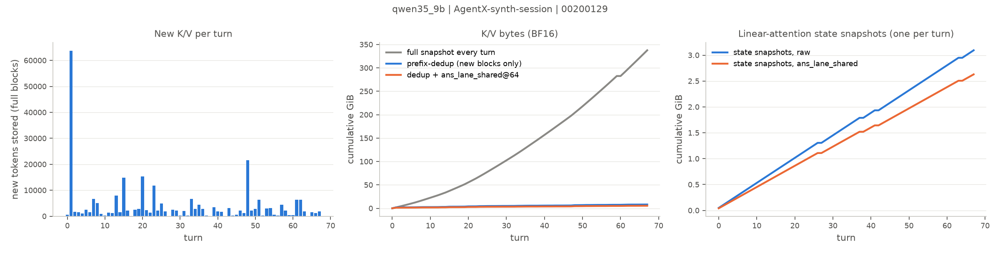
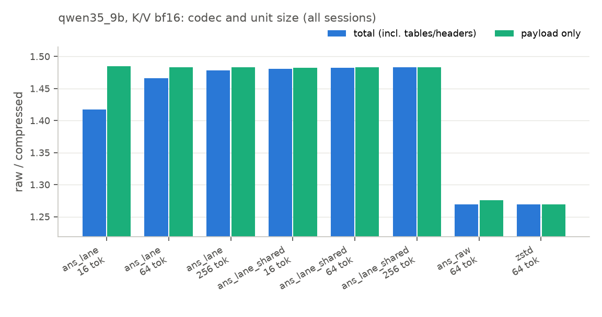
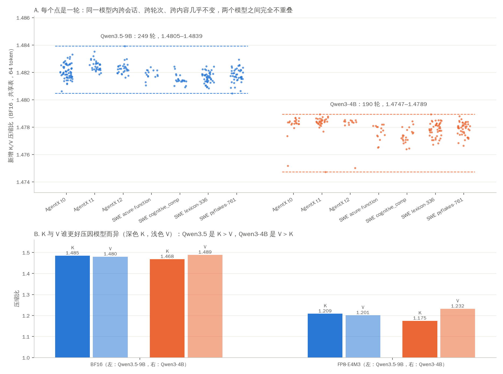

# Agentic 场景下推理缓存（KV cache / 线性注意力 state）的无损压缩：按轮实测结果

> 2026-10-06 组会报告 v2。v1（单请求前缀实验）及其勘误见 [`meeting_2026-10-06.md`](meeting_2026-10-06.md)。
> 报告中每一个数字都可以从 `results/` 下的文件重新计算，计算脚本为 `scripts/report_tables.py`，汇总入口为 `results/20261005_n5_report_tables/` 与 `results/20261005_n4b_summary/`。

---

## 0. 一页结论

**问题**：在 agentic（多轮、工具调用）推理中，每一轮请求会在之前的上下文后面追加新内容。推理引擎为这些内容保存的 KV cache（以及混合架构模型的线性注意力 state），有多少可以被**无损**压缩？我们按“每一轮对话”的粒度做了真实模型前向测量。

| # | 结论 | 关键数字 |
|---|---|---|
| 1 | **前缀去重（prefix cache）的收益远大于熵编码。** agentic 会话里，一轮请求的输入通常 99.5%（中位数；p10 为 97%）与之前完全相同，真正需要新存的只是一小段。 | 50 个 AgentX 会话整体去重 **90×**（单会话中位数 28×）；每轮新增 token 中位数 1,792 |
| 2 | **在去重之后，无损熵编码还能再压约 1.48×（BF16 K/V）或约 1.20×（FP8 K/V）。** | BF16：Qwen3.5-9B **1.482×**，Qwen3-4B **1.478×**；FP8：1.205× / 1.203× |
| 3 | **这个压缩率在同一模型内几乎是常数**：跨会话、跨轮次、跨内容（合成 vs 真实 SWE-agent 轨迹）的差异都在 ±0.1% 左右；两个模型之间则稳定地不同，逐轮数值完全不重叠。它由模型数值的分布决定，与对话内容无关。 | 每轮：Qwen3.5 1.4805–1.4839，Qwen3-4B 1.4747–1.4789 |
| 4 | **我们的 ANS 已经贴近该建模方式的理论极限**（只差约 0.2%）；继续提升需要更强的建模，而不是换熵编码器。通用压缩器 zstd 在 BF16 上明显更差。 | order-0 熵上限 1.485×；zstd 1.27× |
| 5 | **概率表必须共享**：如果每个块自带概率表，小块（16 token）会损失 4.5%；改用离线校准、全模型共享的表（约 100 KB）后，块大小基本不再影响压缩率。 | 16-token 块：自带表 1.417× → 共享表 1.481× |
| 6 | **混合架构模型（Qwen3.5）的 state 快照是不可忽视的存储成本**：按“每轮存一份”的策略，每份约 49.5 MB，且只能压到 1.18×。在增量很小的轮次里，它比新增 K/V 还大。 | state 占存储的 21%–29%（AgentX）到 59%–70%（短轨迹） |
| 7 | **全部结果都逐字节无损**，并从压缩归档重建 cache、续算验证。 | 1,659 万个编码单元 100% bit-exact |

**一句话**：agentic 场景的存储机会主要来自“复用结构”（去重 + 冷前缀管理），每个字节本身的可压缩性和普通场景没有区别；在去重之后，用共享概率表的 ANS 可以稳定地再拿到约 1.48×（BF16）的无损压缩。

---

## 1. 背景（给不熟悉本项目的读者）

**KV cache**：Transformer 每处理一个 token，都会在每个注意力层保存这个 token 的 Key 和 Value 向量，后续 token 直接复用，而不必重算。它的大小随上下文长度线性增长。例如 Qwen3-4B 每个 token 要 144 KiB，一个 12 万 token 的上下文就有约 16 GiB。

**线性注意力 state（混合架构）**：Qwen3.5 只有 8/32 层是普通注意力（有 KV cache），其余 24 层是线性注意力（Gated DeltaNet），保存的是一个**固定大小**的 state（这里每份约 49.5 MB），与上下文长度无关。

**Prefix cache（前缀缓存）**：如果新请求和旧请求开头相同，引擎直接复用旧的 KV，只计算新增部分。agentic 场景（例如 Claude Code）每一轮都是“之前的全部内容 + 新的工具输出”，所以复用率极高。

**冷 KV / offload**：等待工具执行或用户输入时，KV 暂时用不到，可以挪到 CPU 内存或 SSD（Mooncake、LMCache 就是做这个的）。压缩能同时节省容量和传输带宽。

**无损压缩 / 熵编码 / ANS**：无损指解压后与原数据逐比特相同。熵编码利用“某些数值出现得更频繁”来缩短编码；ANS 是一种快速的熵编码。BF16 数值由 1 位符号、8 位指数、7 位尾数组成：**指数部分分布很集中（好压），尾数部分接近随机（压不动）**，这决定了 BF16 大约只能压到 1.5×。

---

## 2. 实验设计

### 2.1 我们到底测什么：两种收益分开算

对一个会话里的每一轮请求：

```
Snapshot   每一轮都完整存一份 K/V（没有 prefix cache 时的存储量）
Unique     只存之前没出现过的新块（prefix cache 实际要存的）
Compressed 对新块（以及混合模型的 state 快照）做无损编码后的字节数

R_dedup = Snapshot / Unique       去重收益：只由会话结构决定，与压缩算法无关
R_codec = Unique   / Compressed   熵编码收益：本报告所说的“无损压缩率”
```

两者相乘才是端到端的节省，但**不能把去重收益算作熵编码的功劳**，这是本轮与 v1 最大的区别。

- 块 = 64 个 token（与 AgentX trace 的块大小一致）。只有**整个前缀都相同**的块才算重复，因为 K/V 依赖完整前缀。
- 压缩比一律按 `Σ原始字节 / Σ压缩后总字节` 计算，压缩后字节**包含**解码所需的全部元数据（概率表、头部）。共享概率表单独计费一次。

### 2.2 按轮测量流程

```
对会话的第 t 轮输入：
  1. 与模型当前缓存比对，找到相同的前缀长度
  2. 只对新增 token 做增量 prefill（分叉时：标准模型裁剪 KV；混合模型恢复最近的 state 快照或从头重算）
  3. 找出之前从未存过的 64-token 块，取出它们的 K/V
  4. 混合模型：在最后一个完整块的边界保存一份 state 快照（recurrent + conv）。这是本实验采用的快照策略（见 3.6），不是唯一做法
  5. 用所有 codec 编码新块和快照，并逐字节解码比对
会话结束：从压缩归档重建最终的 cache，与模型实际的 cache 比对，并续算 1 个 token 核对输出
```

### 2.3 数据

| 数据 | 会话结构 | 内容 | 本轮用量 |
|---|---|---|---|
| **AgentX**（SemiAnalysis，`cc-traces-weka-062126`） | 真实 Claude Code 会话：每轮长度、前缀复用关系、时间、subagent | **合成**：公开 trace 不含原文，由 AIPerf 按 hash 生成（模板代码 / bash / JSON 片段拼接） | 结构分析 50 个会话；按轮实验 3 个会话（trace 0/1/2，数据集的前 3 个，预先固定）；trace 3 留作概率表校准 |
| **SWE-agent 轨迹**（`nebius/SWE-agent-trajectories`） | 真实 SWE-agent 多轮 | **真实**的代码与工具输出；助手回复来自 Llama-70B agent | 4 条，选择规则：前 4 个“≥15 轮且任务各不相同”的样本 |

### 2.4 模型、格式与编码器

- **模型**：Qwen3.5-9B（混合架构：8 层普通注意力，K/V 为 BF16；24 层 Gated DeltaNet，recurrent state 为 FP32、conv state 为 BF16），Qwen3-4B-Instruct-2507（标准 dense GQA，36 层全部为 K/V，BF16，每 token 144 KiB）。两个模型的结构都由真实前向逐层审计确认。
- **K/V 格式**：BF16（模型原生），以及 FP8-E4M3（模拟 vLLM `kv_cache_dtype=fp8`：scale=1.0 饱和转换，**事后转换、不回灌模型**；实测没有任何元素被截断）。
- **编码器**：
  - `zstd`（level 3，通用压缩基线）
  - `ans_raw`：把字节流直接做 ANS（基线）
  - `ans_lane`：按元素宽度分路（BF16 拆成高/低两个字节流，FP32 拆成 4 路），每路独立建模，**每块自带概率表**
  - `ans_lane_shared`：同上，但使用**离线校准、全模型共享**的概率表（在留出的 trace 3 上统计，每个模型约 100 KB，单独计费）
- **编码单元大小**：16 / 64 / 256 token（每个单元 = 一层的 K 或 V × 一段 token × 全部 head）。

### 2.5 环境

单张 RTX A6000（48 GB），batch=1，Hugging Face Transformers 5.17.0 + PyTorch 2.11.0，SDPA；ANS 使用 constriction 0.5.0，zstd 使用 zstandard 0.25.0。全部 v2 按轮实验共 22 次运行，GPU 墙钟约 2.3 小时。

---

## 3. 结果

### 3.1 AgentX 会话结构：复用率有多高（不涉及模型）

来源：`results/20261004_n0_trace_structure/`，共 50 个会话、7,291 轮主线程请求。

| 指标 | 数值 |
|---|---|
| 整体去重比（Σ每轮输入 / Σ唯一块） | **90.0×** |
| 单会话去重比 p10 / p50 / p90 | 14.9× / 28.1× / 132× |
| 每轮命中已有前缀的比例 p10 / p50 | 97.0% / 99.5% |
| 每轮新增 token p50 / p90 | 1,792 / 4,416 |
| 每个会话的主线程轮数 p10 / p50 / p90 / 最大 | 20 / 55 / 580 / 1,009 |
| 会话最长输入 p10 / p50 / p90 / 最大 | 110K / 215K / 817K / 877K token |
| 相邻请求时间间隔 p50 / p90 | 17 秒 / 148 秒 |
| 含 subagent 的会话 | 26 / 50 |

**解读**：典型的一轮只新增约 2K token，却要带着十几万 token 的前缀。如果每轮都完整存一份，存储会膨胀几十倍。请求之间常有几十秒到几分钟的间隔，这就是“冷 KV”的来源（本轮未展开研究，见第 6 节）。

### 3.2 按轮存储账本（每个会话）

来源：`results/20261005_n5_report_tables/storage_by_session.csv`。主编码器为 `ans_lane_shared`，64-token 单元。

| 模型 | 数据 | 会话 | 处理轮数 | 最终上下文 | 全量快照 K/V | 去重后 K/V | state 快照 | 压缩后总存储 | R_dedup | R_codec (K/V) | R_codec（含 state） |
|---|---|---|---|---|---|---|---|---|---|---|---|
| Qwen3.5-9B | AgentX | t0 | 68/131（截断） | 262K | 337.6 GiB | 8.11 GiB | 3.09 GiB | 8.10 GiB | 41.6× | 1.482× | 1.383× |
| Qwen3.5-9B | AgentX | t1 | **33/33** | 120K | 88.8 GiB | 3.69 GiB | 1.50 GiB | 3.76 GiB | 24.1× | 1.483× | 1.379× |
| Qwen3.5-9B | AgentX | t2 | **29/29** | 169K | 112.2 GiB | 5.21 GiB | 1.35 GiB | 4.67 GiB | 21.5× | 1.483× | 1.407× |
| Qwen3-4B | AgentX | t0 | 20/131（截断） | 119K | 230.9 GiB | 16.5 GiB | — | 11.2 GiB | 14.0× | 1.478× | 1.478× |
| Qwen3-4B | AgentX | t1 | **33/33** | 120K | 399.4 GiB | 16.6 GiB | — | 11.2 GiB | 24.1× | 1.478× | 1.478× |
| Qwen3-4B | AgentX | t2 | 13/29（截断） | 129K | 163.1 GiB | 17.9 GiB | — | 12.1 GiB | 9.1× | 1.478× | 1.478× |
| Qwen3.5-9B | SWE-agent | traj0–3 | 全部完整 | 16–32K | 4.1–21.3 GiB | 0.50–0.99 GiB | 0.73–2.22 GiB | 0.95–2.53 GiB | 8.3–22.4× | 1.481–1.482× | **1.255–1.285×** |
| Qwen3-4B | SWE-agent | traj0–3 | 全部完整 | 15–31K | 17.6–90.7 GiB | 2.11–4.20 GiB | — | 1.43–2.84 GiB | 8.3–22.5× | 1.477–1.478× | 1.477–1.478× |

**怎么读这张表**：以 Qwen3.5 t1 为例，如果每一轮都完整存 K/V，需要 88.8 GiB；prefix cache 只存新块，降到 3.69 GiB（24×）；再加上每轮的 state 快照（1.50 GiB），无损编码后总共 3.76 GiB。只看 K/V 时，端到端相对“每轮全量存储”节省约 36×。

- 截断会话是因为达到了实验设定的上下文上限（Qwen3.5 262K、Qwen3-4B 131K，受单卡显存限制），截断原因自动记录在 `verification.json` 中。
- R_dedup 只取决于会话结构：同一会话在两个模型上的 R_dedup 完全相同（例如 t1 都是 24.1×），这也验证了实现的一致性。
- **为什么这里的 R_dedup（3.4×–41.6×）比 3.1 的整体 90× 小？** 三个原因：
  1. 90× 是 50 个会话合在一起按 token 加权的结果，由少数超长会话主导（最长的有 1,009 轮、87.7 万 token，单会话去重比可达 200×）。和单个会话可比的是 3.1 里的**单会话中位数 28×**。
  2. R_dedup 随轮数增长：每一轮都要重新带上整个前缀，轮数越多，“全量快照”累积得越快，而唯一块只增长一点。
  3. 部分会话被截断，只统计了前若干轮。完整跑完的会话与 3.1 的 trace 统计完全吻合：t1 都是 24.1×，t2 都是 21.5×；t0 的完整会话在 trace 统计中是 80×，按轮实验只跑到第 68 轮，所以是 41.6×。



*图 1：Qwen3.5-9B、AgentX 会话 t0（68 轮）。左：每轮新增需要存储的 token（第 1 轮是约 64K token 的初始上下文，之后每轮通常 1–3K）；中：K/V 累计存储（灰：每轮全量；蓝：去重后；橙：去重 + 无损编码）；右：state 快照累计存储。*

### 3.3 熵编码压缩率（核心表）

来源：`results/20261005_n4b_summary/codec_table.csv`，每个模型 7 个会话合并（按字节加权）。“理论上限”指同一建模方式（分路、order-0）的经验熵，只作参照。

**BF16 K/V（64-token 单元）**

| 编码器 | Qwen3.5-9B | Qwen3-4B |
|---|---|---|
| zstd（通用压缩） | 1.269× | 1.276× |
| ans_raw（不分路） | 1.269× | 1.267× |
| ans_lane（分路，每块自带表） | 1.466× | 1.462× |
| **ans_lane_shared（分路，共享表）** | **1.482×** | **1.478×** |
| 只算 payload（不计任何元数据） | 1.483× | 1.479× |
| order-0 熵上限 | 1.485× | 1.481× |

**按 K 和 V 拆开（ans_lane_shared，64 token）**

| | Qwen3.5-9B | Qwen3-4B |
|---|---|---|
| Key | 1.485× | 1.468× |
| Value | 1.480× | 1.489× |

**FP8-E4M3 K/V（64 token）**

| 编码器 | Qwen3.5-9B | Qwen3-4B |
|---|---|---|
| zstd | 1.198× | 1.204× |
| ans_lane（每块自带表） | 1.194× | 1.193× |
| **ans_lane_shared** | **1.205×** | **1.203×** |
| order-0 熵上限 | 1.207× | 1.205× |

**解读**：

- **分路是关键**。把 BF16 的高字节（符号 + 指数）和低字节（尾数）分开建模，比不分路高约 17%。不分路的 ANS 和 zstd 都在 1.27× 左右。
- **ANS 已经贴近理论值**：共享表版本只比 order-0 熵上限低约 0.2%。要再提高，必须换更强的建模方式（例如按位拆出完整的 8 位指数、按 head 或 channel 分别建模、利用相邻 token 的相关性），而不是换熵编码器。
- **FP8 本身已经很紧凑**（每个值 1 字节），只能再压约 1.2×。在 FP8 上 zstd 与 ANS 基本持平（Qwen3-4B 的 Value 上 zstd 甚至略高于 order-0 上限），说明 FP8 数据存在少量 order-0 模型抓不到的结构。
- 两个架构差异很大的模型压缩率几乎一样（相差 0.3%）；K 和 V 谁更好压则因模型而异。



*图 2：Qwen3.5-9B BF16 K/V，各编码器与单元大小。蓝：计入全部元数据；绿：只算 payload。*

### 3.4 稳定性：跨会话、跨轮次、跨内容

| 维度 | 结果（BF16 K/V，ans_lane_shared） |
|---|---|
| 跨会话（每个模型 7 个） | Qwen3.5：1.4814–1.4827；Qwen3-4B：1.4774–1.4784 |
| 跨轮次（全部会话的每一轮） | Qwen3.5：1.4805–1.4839（249 轮）；Qwen3-4B：1.4747–1.4789（190 轮），两模型不重叠（图 3） |
| 合成内容 vs 真实内容 | Qwen3.5：AgentX 1.4825 vs SWE-agent 1.4817；Qwen3-4B：1.4784 vs 1.4777 |



*图 3：（A）每个点是一轮：2 个模型共 14 个会话中每一轮新增 K/V 的压缩比（BF16，共享表，64 token）。同一模型内，跨会话、跨轮次、跨内容（AgentX 合成 vs SWE-agent 真实）的波动约 0.003–0.004；两个模型之间完全不重叠：Qwen3.5 全部 249 轮在 1.4805–1.4839，Qwen3-4B 全部 190 轮在 1.4747–1.4789。（B）K 与 V 的压缩比：Qwen3.5 是 K > V，Qwen3-4B 是 V > K，FP8 下差异更明显（Qwen3-4B：K 1.175 vs V 1.232）。数据：`results/20261005_n5_report_figures/`。*

单会话按轮的旧图仍保留在 `results/20261005_n4b_summary/figures/per_turn_kv_ratio.png`。

**解读**：熵编码压缩率是**模型数值的固有属性**：同一模型内几乎不随对话内容、轮次或会话变化，不同模型之间则有稳定的差异（整体水平不同，K/V 的相对关系也不同）。这有两层含义：（1）AgentX 的合成内容不会让这个指标失真，用它做结构研究是可靠的；（2）agentic 场景**并不比普通场景每字节更好压**，它的价值在于复用结构。

### 3.5 元数据与块大小

| 单元大小 | 每块自带表（ans_lane） | 共享表（ans_lane_shared） | 只算 payload |
|---|---|---|---|
| 16 token | 1.417× | 1.481× | 1.484× |
| 64 token | 1.466× | 1.482× | 1.483× |
| 256 token | 1.479× | 1.483× | 1.483× |

（Qwen3.5-9B，BF16 K/V；Qwen3-4B 趋势相同。）

**解读**：块越小，每块自带的概率表（每路 512 B）占比越大。改用共享表后，16-token 小块也能拿到几乎全部收益。共享表的总大小为 Qwen3.5 96 KiB、Qwen3-4B 108 KiB，**只需随解码器分发一次**。

**概率表的大小由什么决定？** 单张表 = 符号种类数 × 每项精度 = 256 种字节取值 × 2 字节（16 位计数）= **512 B**。每个字节流（“路”）需要一张：BF16 拆 2 路、FP32 拆 4 路、FP8 只有 1 路。共享表按（K/V 格式, 状态类型, 层, 路）各存一张，所以总大小取决于层数和状态种类：
- Qwen3.5：BF16 K/V 8 层 × K、V 两种 × 2 路 = 32 张；FP8 K/V 8 × 2 × 1 = 16 张；recurrent 24 层 × 4 路 = 96 张；conv 24 层 × 2 路 = 48 张；共 192 张 × 512 B = 96 KiB。
- Qwen3-4B：BF16 K/V 36 × 2 × 2 = 144 张；FP8 K/V 36 × 2 × 1 = 72 张；共 216 张 × 512 B = 108 KiB。

只部署一种 K/V 格式时表会更小（例如 Qwen3-4B 只用 BF16 时为 72 KiB）；如果相邻层的分布相近，也可以让多层共用一张表。

共享表是在留出的会话（trace 3）上校准的。与“每块用自己的最优表、且表不计费”的理想情况相比，它在其他 AgentX 会话上只损失 0.07%–0.08%，在 SWE-agent 真实内容上损失 0.10%–0.13%，说明一张表可以跨会话、跨内容使用。这对“不同用户的冷 KV 一起压”这个方向是一个积极信号：至少在统计建模层面，不同会话可以共享同一个模型。

### 3.6 混合架构模型的 state 快照

| 指标（Qwen3.5-9B） | 数值 |
|---|---|
| 每份快照大小 | 49.5 MiB（24 层 recurrent FP32 48 MiB + conv BF16 1.5 MiB） |
| 压缩比：recurrent / conv / 合计 | 1.170× / 1.474× / **1.178×**（zstd：1.066× / 1.265× / 1.071×） |
| AgentX：每轮新增 K/V 中位数 vs 快照 | 48–66 MiB vs 49.5 MiB；32%–45% 的轮次快照比新增 K/V 还大 |
| SWE-agent：每轮新增 K/V 中位数 vs 快照 | 6–42 MiB vs 49.5 MiB；84%–100% 的轮次快照更大 |
| 快照占存储的比例 | AgentX 21%–29%；SWE-agent 59%–70% |

**快照频率是一个策略假设。** 线性注意力的 state 无法按 token 切分，只能在可能被复用的位置整份保存。本实验假设：**每一轮只要产生了新的完整块，就在最后一个完整 64-token 块的边界存一份快照**（没有新块的轮次不存）。生产引擎可以有不同的策略：存得更密（例如每个块边界都存），分叉后的复用更灵活，但存储会成倍增加；存得更稀，存储更少，但分叉时要重算更多 token。因此本节的“快照占比”依赖这个策略；单份快照大小（49.5 MiB）和单份压缩比（1.18×）与策略无关。按每轮一份估算，一轮新增少于约 1,600 token（49.5 MiB ÷ 32 KiB/token）时，这一轮的快照就会比它的新增 K/V 更大。

**解读**：混合架构让 K/V 变小了（只有 8 层有 K/V，每 token 32 KiB），但支持 prefix cache 需要保存固定大小的 state 快照。这份快照不能跨轮去重，而且是 FP32，只能压到 1.18×。在增量很小的 agentic 轮次里，**它成了主要的存储成本**。这是混合架构模型在 agentic 场景下一个值得关注的系统问题。

### 3.7 正确性验证

- 最终使用的 14 个会话共编码 **16,590,152** 个单元（每个单元 × 每种编码器各算一次），全部解码后与原始字节逐一比对，**100% 一致**。
- 13/14 个会话通过“从压缩归档重建 cache”的端到端检查；1 个跳过（Qwen3.5 t1：最后一轮没有新块，因而没有最终 state 可供比对）。
- 7 个标准模型会话中，重建出的 cache 与模型实际 cache 逐比特相同，续算输出完全一致。Qwen3.5 有 4 个会话出现差异块（16–45,260 个）：会话中途分叉后，引擎从快照恢复并**重算**了一部分已经存过的块，重算结果在 BF16 末位上与当初存下的原块略有不同（续算 hidden 最大差 0.25）。这是推理路径的数值差异，不是压缩错误；压缩本身的无损性由逐单元比对保证。

---

## 4. 这些结果对研究方向意味着什么

1. **“压缩冷 prefix cache”这个方向成立，但收益来源要说清楚**：一个 agentic 会话需要保存的状态里，绝大部分冗余是“重复前缀”，应该先用去重（prefix cache 本身）消除。剩下的唯一数据可以再无损压缩约 1.48×（BF16）或 1.20×（FP8），这部分收益稳定、可预测，可以直接用于容量规划。
2. **在 offload 路径上的意义**：1.48× 意味着同样的 DRAM / SSD 可以多放约 48% 的冷 KV，同样的带宽可以多传约 48%。但前提是编解码速度跟得上：本轮的 CPU 实现（constriction，本地基准单核约 22 MB/s，编码+解码）远不够快，GPU 或硬件实现的吞吐还**没有测量**。这正是师兄提到的“GPU 不够快就做硬件”的切入点，下一步需要量化。
3. **继续提升压缩率要靠建模，不靠换编码器**：order-0 ANS 已经到顶。按位拆分指数、按 head/channel 建模、利用 token 间相关性，是可能的提升方向，但需要先实测收益是否值得额外的计算。
4. **混合架构模型需要单独考虑 state 快照**：快照的存储与压缩（FP32、只能压 1.18×）可能比 K/V 更值得优化，例如降低快照频率，或对 state 做专门的编码。
5. **“不同用户一起压缩”**：统计层面的共享已有初步证据（一张校准表通用于不同会话和内容）。“完全相同块”的跨用户去重需要带全局 hash 的数据，AgentX 不支持（`hash_id_scope=local`），尚未测量。

---

## 5. 局限（请在引用结果时注意）

- **AgentX 的内容是合成的**：只有会话结构是真实的。我们用真实 SWE-agent 轨迹做了对照，熵编码压缩率一致，但 4 条轨迹都较短（15–32K token），而且只来自一个 agent（Llama-70B）。
- **只测了两个较小的模型**（9B 混合架构、4B dense），都是 Qwen 家族；MLA（DeepSeek）、滑窗注意力（gpt-oss）、更大的 MoE 模型尚未测量。
- **长会话被截断**：受单卡显存限制，Qwen3.5 最多到 262K、Qwen3-4B 到 131K，3 个 AgentX 会话中有部分只处理了前若干轮（截断原因已记录）。
- **K/V 由 HF Transformers 产生**，不是 vLLM/SGLang 的实际 cache；数值分布应当一致，但比特不完全相同。FP8 是事后转换模拟，不是原生 FP8 serving。
- **只测了压缩率，没有测编解码吞吐、延迟和系统收益**（TTFT、offload 带宽等）。
- 共享概率表只在 1 个留出会话上校准。
- 混合模型的 state 快照按“每轮一份”的策略计入存储；采用其他快照策略时，state 的存储占比会不同（见 3.6）。
- 资源记录：首轮 N1/N2 运行时未设置 `CUDA_VISIBLE_DEVICES`，实际使用了 GPU 0（计划为 GPU 1）。数据不受影响（同型号显卡），已记录；最终结果中只有 Qwen3.5 t1 一个会话来自那批运行，其余补跑均在 GPU 1 上完成。

---

## 6. 建议的下一步（供讨论）

| 优先级 | 方向 | 目的 |
|---|---|---|
| 高 | 编解码吞吐：GPU ANS / nvCOMP 等现成实现的实测，以及 offload 路径的 break-even 模型 | 判断 1.48× 能否转化为实际的带宽/容量收益，以及是否需要硬件 |
| 高 | 冷 KV 量化：用 AgentX 的时间戳定义“冷”（例如超过 X 秒未访问），统计冷数据量与再次访问的距离 | 回答“有多少 KV 值得压缩”，把 R_dedup 与冷数据结合起来 |
| 中 | 扩展模型：MLA（DeepSeek-V2-Lite）、gpt-oss-20b、Llama-3.1-8B | 检验 1.48× 是否在不同架构上成立 |
| 中 | 更强建模的上限：按位拆分指数、按 head/channel 建模 | 判断 order-0 之外还有多少空间 |
| 中 | 原生 FP8 serving 导出（vLLM / LMCache） | 替代事后转换的 FP8 模拟 |
| 低 | 跨用户完全相同块去重 | 需要带全局 hash 的数据 |

---

## 附录 A：与 v1 的关系

v1 只取了每个会话第 1 个请求的前 2K/8K token，没有多轮信息，并且有三处结论在复盘后被修正：

- “块大小影响”其实来自元数据；
- “完整状态压缩率”随长度变化；
- headline 用了最弱的编码器。

v2 改为按轮测量完整会话，并把去重与熵编码分开核算。v1 中 BF16 K/V byte-lane 约 1.47–1.49× 的数值与 v2 一致。详见 [`meeting_2026-10-06.md`](meeting_2026-10-06.md) 开头的勘误。

## 附录 B：运行清单与复现

| 节点 | 内容 | 结果目录 |
|---|---|---|
| N0 | AgentX 50 个会话结构分析（CPU） | `results/20261004_n0_trace_structure/` |
| 校准 | 共享概率表（trace 3，前 3 轮） | `results/20261004_n1_qwen35_calib/`、`results/20261005_n2_qwen3_4b_calib/` |
| 审计 | Qwen3-4B 缓存结构 | `results/20261005_n2_qwen3_4b_audit/` |
| N1/N1b | Qwen3.5-9B AgentX 按轮（N1b 为长上下文补跑） | `results/20261005_n1_qwen35_t1/`、`results/20261005_n1b_qwen35_long_t{0,2}/` |
| N2b | Qwen3-4B AgentX 按轮（长上下文） | `results/20261005_n2b_qwen3_4b_long_t{0,1,2}/` |
| N3b | SWE-agent 真实轨迹 × 2 个模型 | `results/20261005_n3b_{qwen35,qwen3_4b}_traj{0..3}/` |
| N4b | 汇总表与图 | `results/20261005_n4b_summary/` |
| 报告表 | 本报告引用的全部数字 | `results/20261005_n5_report_tables/` |
| 报告图 | 跨模型稳定性图（图 3）及逐轮数据 | `results/20261005_n5_report_figures/` |

被长上下文版本取代的短版运行（`20261005_n1_qwen35_t{0,2}`、`20261005_n2_qwen3_4b_t*`、`20261005_n3_qwen3_4b_traj*`，以及 smoke）都保留在 `results/` 中，作为历史记录；它们的压缩归档在重建检查通过后已删除（见 `logs/cleanup_20261005.log`），逐单元校验和仍在。

复现命令见 `plans/weekly/2026-10-06.md` 的“v2 范围变更”一节；配置为 `configs/turns.yaml` 与 `configs/turns_long.yaml`，汇总命令为：

```bash
.venv/bin/python scripts/summarize_turns.py --run-id <id> <run_ids...>
.venv/bin/python scripts/report_tables.py --run-id <id> --summary 20261005_n4b_summary --trace-structure 20261004_n0_trace_structure
.venv/bin/python scripts/report_figures.py --run-id <id> --summary 20261005_n4b_summary
```
